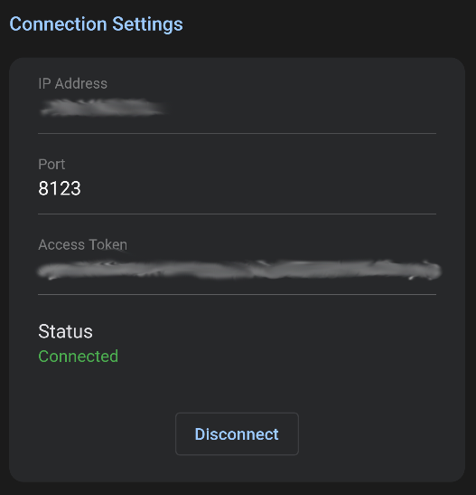

# Dynamote Home Assistant Integration

<p align="center">
	
</p>

<p align="center">
	<a href='https://play.google.com/store/apps/details?id=com.electricedge.dynamote'>
		
	</a>
</p>

This is the third party integration for Home Assistant that enables it to communicate with Dynamote devices.

## Installation

### Recommended Method - HACS

- Ensure that [HACS](https://hacs.xyz/) is installed
- Add this repository as a custom repository in HACS (integration type repository)
- Install the Dynamote integration in HACS
- Restart your Home Assistant server

### Manual install

- Download this repository
- Copy the folder "custom_components/dynamote" into the "custom_components" directory of your config folder
- Restart your Home Assistant Server

## Configuration

Add the following line to your configuration file to enable this integration, then restart your Home Assistant server. This will add a button entity for each dynamote command.

```yaml
button:
  - platform: dynamote
    name: turn_on_tv
    command: turn_on_tv
  - platform: dynamote
    name: increase_tv_volume
    command: increase_tv_volume
```

The name should be what you want the button entity to be named in Home Assistant. Command should be the command ID that you set up the command with in the dynamote app (see next section).

## Configuration

First you must configure and upload your commands to Home Assistant, this is done from the Dynamote app. You must create a [long-lived access token](https://developers.home-assistant.io/docs/auth_api/#long-lived-access-token) for the app to be able to communicate with your Home Assistant server.

Connect with the IP address, port, and access token of your Home Assistant server. It usually uses port 8123.

<p align="center">
	
</p>

Once connected, you may edit/add the available commands for Home Assistant to use. Once completed, press the upload button at the top of the page in the app.

<p align="center">
	
</p>